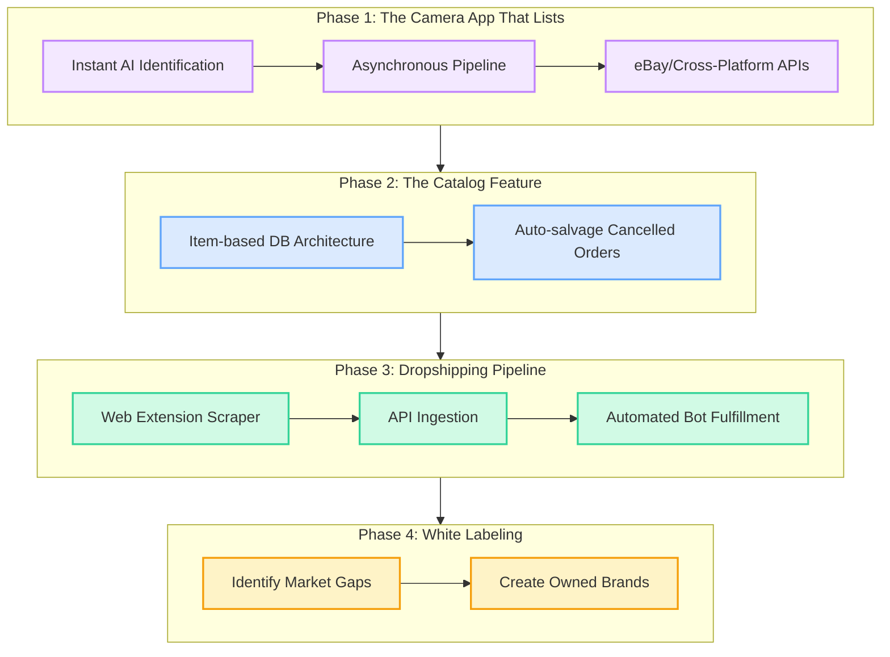

# Wonni

**AI-first marketplace iOS app.** Wonni helps sellers list fast (camera → AI identification → live listing in seconds) and helps buyers discover, save, and buy items.

**Author:** Jerry Shi  
**Stack:** SwiftUI · Firebase (Auth, Firestore, Storage, AI) · Gemini Flash API

---

## Project Motivation

As previously mentioned, there already are a few options for sellers looking for an AI-enabled cross-listing app. The differentiator here is that the UI design should make listing even faster. Furthermore, our product roadmap is to implement cross-listing > importing URLs to scrape product info > drop-shipping pipelines > fully fledged catalog of products.

## Project Timeline

With AI, it is easy to get stuck in infinite scope creep. Over the last two days (6/2 - 6/3), I worked on implementing Mercari auto-fill. Eventually, I had to recognize that the feature had to be left in "good enough" mode instead of sucking up all the time to implement one feature.

---

## Product Vision

> **This section documents strategic decisions that are intentionally deferred to post-1.0 but must not be designed around or away from.**

### The Item Catalog (post-1.0)

The long-term data model for Wonni is **organized by item, not by listing** — closer to Amazon than eBay. A `CatalogItem` is a shared, platform-managed product record (think: "2024 Starbucks Popcorn Bucket, Red Edition"). Multiple sellers can each have a `UserListing` that references the same `CatalogItem`.

This is deferred from 1.0 due to implementation complexity (catalog seeding, matching heuristics, moderation) — but the FK scaffolding is already in place so no migration is needed.

**Why this is the core strategic bet — four compounding benefits:**

**1. Out-of-stock conversion (buyer side)**  
On eBay, a sold-out listing is a dead end — the buyer sees "similar items" that may be irrelevant. On Wonni, a sold-out `CatalogItem` page can surface:
- A "Notify me when back in stock" watchlist button that actually works (we know exactly which item they want)
- An auto-purchase option (first seller who relists at ≤ $X automatically fulfills it)
- A real-time count of other sellers currently listing this item

**2. Cancelled order salvage (seller + buyer side)**  
When Seller A cancels a transaction, Wonni can silently route the order to Seller B who has the same `CatalogItem` in stock — Seller B makes a sale they never would have seen, and the buyer's experience is seamless. This is only possible when you know that two separate `UserListings` represent the same physical item.

**3. Better pricing data (seller side)**  
Pricing on eBay requires searching "sold listings" manually. A `CatalogItem` accumulates real transaction history across all sellers — median sale price, 30-day trend, seasonal patterns. Wonni can pre-fill a suggested price at listing time with actual confidence. This lowers seller friction and anchors prices to reality.

**4. Demand aggregation for seller acquisition**  
This is the flywheel nobody sees: when 50 buyers are watching a sold-out `CatalogItem`, that demand signal is invisible to potential sellers today. With the catalog, Wonni can message sellers: *"47 people are actively watching this item and there are 0 in stock — list yours now."* This turns latent buyer demand into direct seller acquisition, without any paid marketing.

**Existing scaffold (already built):**
- `CatalogItem.swift` — model file exists in `Models/`
- `UserListing.catalogItemId: String` — FK field present on every listing
- `SavedItem.catalogItemId: String?` — nil now, ready for catalog migration
- `InventoryUnit.swift` — per-unit tracking model exists
- Firestore `favorites` subcollection already stores `catalogItemId` for future watchlist use

**What 1.0 avoids:** Wonni 1.0 ships with `catalogItemId = ""` on all listings (no catalog matching). The UI and data layer treat listings independently. The catalog is introduced post-1.0 via a background matching pass (Gemini identifies item → matches to existing `CatalogItem` or creates a new one) without requiring a client update.

### Multi-Platform Business Policy Architecture (Post-1.0)

To avoid polluting sellers' connected accounts (e.g., eBay) with hundreds of duplicated policies and to simplify cross-platform syncing, Wonni adopts the following architecture:

1. **Sync & Name:** Fetch existing fulfillment, return, and payment policies from the seller's connected accounts. Map these directly in the UI so the seller can pick from native policies they already established, maintaining their naming conventions.
2. **Immediate Payment Enforcement:** Always enforce "Require Immediate Payment" for eBay listings. This aligns with modern platforms (Etsy, Shopify) and removes unnecessary payment-policy UI clutter for the seller.
3. **Rules Engine (Stretch Goal):** Instead of a static "Default Policy", settings will evolve into a Rules Engine (e.g., `IF Weight > 10 lbs THEN use 'Heavy Freight Policy' and 'No Returns'`). This automates cross-platform policy selection based on listing properties.

---

## Building and Running

```bash
open wonni/wonni.xcodeproj
```

Requirements: iOS 17+, Xcode 15+, camera + photo library permissions.

```bash
# CLI build
cd wonni
xcodebuild -project wonni.xcodeproj -scheme wonni \
  -destination 'platform=iOS Simulator,name=iPhone 15' build
```

---

## Architecture

### Backend

All data lives in Firebase:

| Service | Purpose |
|---|---|
| **Firestore** | Listings, users, sales, conversations, messages, favorites, search history |
| **Firebase Storage** | Listing photos at `users/{userId}/{listingId}/{index}.jpg` |
| **Firebase Auth** | Sign In with Apple + email/password |
| **Firebase AI (Gemini)** | Item identification from photos — model `gemini-1.5-flash` via `.googleAI()` backend |
| **Cloud Functions (Node.js)** | eBay/Etsy OAuth, cross-posting, listing sync, sale sync (`syncSales`) |

### Data Layer (`wonni/Data/`)

| File | Responsibility |
|---|---|
| `ListingRepository.swift` | CRUD for listings, paginated feed (`fetchFeedPage`), prefix-match search support |
| `StorageService.swift` | Photo upload to permanent Storage paths, deletion |
| `GeminiService.swift` | Item identification from `[UIImage]` → `GeminiIdentificationResponse` |
| `ConversationRepository.swift` | Conversations + messages, offer flow, real-time listeners |
| `SearchRepository.swift` | Trending, search history, saved searches, prefix-match listing search |
| `SaleRepository.swift` | Fetch + delete sales ordered by `soldAt DESC`, filtered by `userId` |
| `UploadManager.swift` | Orchestrates draft → upload → Gemini → publish flow |
| `AuthManager.swift` | Firebase Auth state, sign-in/sign-out |
| `ImageCompressor.swift` | Resize images before Storage upload |

### Models (`wonni/Models/`)

| File | Key Types |
|---|---|
| `UserListing.swift` | `UserListing`, `ListingStatus`, `ItemCondition` |
| `Sale.swift` | `Sale`, `SaleStatus`, `SaleAddress` — sales records with take-home breakdown |
| `CatalogItem.swift` | Shared product catalog (future — referenced by `catalogItemId`) |
| `InventoryUnit.swift` | Per-unit inventory tracking |

### View Structure (`wonni/Views/`)

5-tab navigation (`MainView.swift`):

| Tab | View | Status |
|---|---|---|
| Home | `HomeView` | Live feed + promoted carousel + infinite scroll |
| Search | `SearchView` | Saved / recent / trending + prefix-match results |
| Sell | `CameraView` → `CreateListingView` | Full listing flow |
| Inbox | `InboxView` → `ConversationView` | Messages + offer flow |
| Profile | `ProfileView` | Listings grid + sign out |

Supporting views: `ListingDetailView` (photos, offer button, favorites, suggested listings), `IdentificationConfirmationView` (Gemini result review).

### Key Patterns

**Listing photos:** Pre-generate a UUID client-side as `listingId`, upload to `users/{uid}/{listingId}/{index}.jpg`, then write the Firestore document with that same ID. No temp→promote dance.

**Feed pagination:** Firestore cursor-based (`startAfter(document:)`). `ListingRepository.fetchFeedPage(after:)` returns a `FeedPage` with `lastDocument: DocumentSnapshot?` for the next page. Requires composite index: `status ASC + publishedAt DESC`.

**Promoted banners:** `PromotedBanner` documents in a `promotions` Firestore collection. `destinationType` + `destinationValue` fields drive routing via `BannerDestination` enum — adding a new destination is one enum case + one `navigationDestination` branch. `expiresAt: Timestamp?` for scheduled promotions.

**Conversation IDs:** Deterministic — `"\(buyerId)_\(listingId)"` — one thread per buyer+listing pair, no duplicate-check query needed.

**Search:** Firestore prefix-match on `customTitle` for 1.0. `SearchRepository.search(query:)` is the single method to swap for Algolia (see backlog).

**Favorites:** `users/{uid}/saved/{listingId}` with `catalogItemId: String?` nil now, ready for catalog migration.

---

## Firebase Setup

### Firestore Rules
Deploy with:
```bash
cd wonni && firebase deploy --only firestore:rules
```

### Firestore Indexes
Deploy composite indexes (feed + promotions queries):
```bash
cd wonni && firebase deploy --only firestore:indexes
```

### Storage Rules
```bash
cd wonni && firebase deploy --only storage
```

### Trending Searches
Seed manually in Firebase Console → `trending` collection:
```
query: "Sony headphones"   sortOrder: 0   isActive: true
```

### Promoted Banners
Seed in Firebase Console → `promotions` collection:
```
title: "Weekend Sale"   subtitle: "Up to 40% off"
destinationType: "category"   destinationValue: "Electronics"
isActive: true   sortOrder: 0   colorHex: "3B82F6"
expiresAt: <Timestamp>   (optional, omit for permanent)
```

---

## Feature Status

### ✅ Completed

**Auth & Onboarding**
- Sign In with Apple + email/password via Firebase Auth
- Onboarding flow, sign-out from profile

**Sell Flow**
- Camera view with live viewfinder, photo capture, gallery upload
- Photo stacking (`[[UIImage]]`) with scrollable stack carousel
- Plus button to create new stacks; portrait lock with orientation correction
- Flash animation on capture (known bug: doesn't cover tab bar — see bugs)
- `CustomPhotoPickerView`: library picker with multi-draft support, "hide previously selected" toggle, numbered selection badges
- `BulkListingOverviewView`: draft list with inline title/price/description editing, keyboard navigation, upload progress bar
- `ProcessResultsOverviewView`: AI-processed results, select/deselect per item, "Review & Publish" with per-platform cross-post selection
- `DraftEditSheet`: full per-draft editor (photos, title, price, description, condition, tags, note, shipping, dimensions)
- `DraftHistoryModal`: drag-to-reorder photos across drafts, drag-to-trash, multi-select delete
- `ActiveDraftCarouselView`: shared bottom panel in camera and picker showing committed drafts
- Draft persistence and session restore via SwiftData

**Feed (Home Tab)**
- Live Firestore feed of active listings, 2-column grid with fixed square thumbnails (no overflow)
- Cursor-based infinite scroll (20 per page, `startAfter` cursor)
- Promoted banner carousel: auto-scrolls every 4s, `BannerDestination` routing, `expiresAt` scheduling

**Search Tab**
- Liquid glass search bar: capsule shape + `.ultraThinMaterial` frosted background, camera circle button outside pill, Cancel replaces camera when focused
- Saved searches (Firestore, bookmarked queries, fill bookmark icon when saved)
- Recent searches (Firestore, capped at 10, deduped by query key)
- Trending searches (Firestore `trending` collection, manually curated)
- Section order: Saved → Recent → Trending
- Swipe-to-delete on saved + recent; long-press context menu (Save / Delete)
- Prefix-match search results in 2-column grid

**Listing Detail**
- Photo carousel (TabView paged), price, condition, title, description
- Heart button: tap to save, long-press context menu to add to custom list or create new list
- Make an Offer sheet (hidden for listing owner)
- Offer submitted → conversation created → green toast confirmation
- Suggested listings horizontal scroll

**Inbox & Messaging**
- Mercari-style filter pills: All / Buying / Selling / Unread / Offers
- Real-time conversation listener
- `ConversationView`: message list (auto-scroll to bottom), offer cards, input bar
- Deterministic conversation IDs (one thread per buyer+listing)
- Unread counters, orange Offer badge

**Profile**
- User avatar (initials or photo), display name, @username, email
- Searchable + sortable list of active listings
- `ProfileListingRow` with cross-post status badges (eBay, Mercari, etc.)
- Edit mode with multi-select: bulk delete, bulk "Post to…", bulk edit sheet
- `EditListingSheet`: edit title, price, description, condition, shipping, dimensions, and marketplace toggles
- `EditProfileSheet`: change display name, username, profile photo (Firebase Storage)
- Sign out with confirmation alert

**Cross-Posting**
- **eBay**: full API integration via Firebase Cloud Functions (`ebayCreateListing`, `ebayDeleteListing`, `ebayExchangeToken`); OAuth via `ASWebAuthenticationSession`
- **Mercari**: headless WKWebView auto-poster (`MercariAutoPoster`) using `callAsyncJavaScript`; shared cookie store with `MercariLoginView` (both use `.default()` `WKWebsiteDataStore`); WKNavigationDelegate awaits page load + JS polls for React form mount; writes `crossPostStatus.mercari = "posted"` to Firestore after success
- **Facebook Marketplace**: visible WKWebView (`CrossPostContainerView`) with "Autofill Fields" button; quick-copy header for title/price/description
- Cross-post jobs queue sequentially via `CrossPostJob` / `checkAndStartNextWebJob`; SwiftData items are kept alive until the queue drains, then deleted
- `PlatformStatusBadge`: per-platform posted / pending / failed indicators on listing rows
- `PublishConfirmationSheet` / `BulkCrossPostSheet`: platform selection with API vs autofill labels

**Sales Dashboard**
- `SalesDashboardView` — sales list with summary cards (count / revenue / take-home), platform filter chips, per-sale row with cover photo, take-home hint, and status badge
- `SaleDetailSheet` — full P&L breakdown: item price, shipping charged to buyer, shipping label cost, take-home; ship-to address with copy button; editable carrier / tracking / status
- `SaleRepository.swift` + `Sale.swift` / `SaleStatus` / `SaleAddress` models
- `syncSales` Cloud Function (`functions/sale_poller.js`):
  - Fetches eBay orders via Fulfillment API (`/sell/fulfillment/v1/order`); matches to Wonni listings by `platformListingId`
  - **Take-home**: Finances API paginated up to 5 × 20 transactions, filtered client-side by `orderId` (eBay ignores the server-side filter); uses `SALE.amount` (already net of fees) minus each `SHIPPING_LABEL` cost
  - **Tracking**: `/sell/fulfillment/v1/order/{id}/shipping_fulfillment`, field `shipmentTrackingNumber`; stores latest fulfillment and full `shippingFulfillments` array
  - **Addresses**: ship-to address from `fulfillmentStartInstructions[].shippingStep.shipTo.contactAddress`; `buyerRegisteredAddress` stored separately as bonus data
  - **Revenue split**: `priceSoldFor` = `pricingSummary.priceSubtotal` (item only); `shippingRevenue` = `pricingSummary.deliveryCost`
  - Re-sync / backfill updates tracking, take-home, addresses, and revenue split on all existing orders
- Firestore `sales` collection with owner-only security rule
- Composite index: `sales` collection, `userId ASC + soldAt DESC`

**Backend / Infrastructure**
- Firestore rules: listings, inventory, sales, conversations, messages, users + all subcollections, trending
- Firebase Storage rules: `users/{userId}/**` owner-write + authenticated read
- Composite Firestore indexes: feed query, promotions query, sales query
- Gemini AI: `gemini-1.5-flash` model, resizes images to 1024px before sending

---

### 🔄 Product Roadmap (Integrated Backlog)

This roadmap outlines the plan for executing all remaining features, shifting Wonni from a fast "camera app that lists" to a full-scale AI dropshipping and white-labeling empire.



---

#### 🟣 Phase 1: The "Camera App That Happens to List" (Current Focus)
*Core Problem: Fast asynchronous drafting. Snap photos → AI identifies → posted to platforms instantly without waiting.*

- [x] **AI-driven Identification (Gemini 1.5 Flash)**  
  Analyze photos to auto-generate item titles, suggested prices, category taxonomy, and key specifications.
- [x] **Live eBay API Integration**  
  Publish listings directly to eBay using their v1 Inventory API and handle multi-step offers gracefully.
- [x] **Asynchronous Bulk Pipeline**  
  Snap photos → background upload → Gemini batch process → bulk review → publish to Wonni + cross-post to eBay/Mercari/Facebook in one flow. SwiftData drafts survive app restarts; cross-post jobs queue and run sequentially.
- [x] **Mercari & Facebook Marketplace Cross-Posting**  
  `MercariAutoPoster` headless WKWebView flow: await navigation, JS-poll for React form mount, inject title/price/description, attempt photo `DataTransfer`, click submit, write `crossPostStatus` to Firestore. Facebook uses visible WebView with autofill button.
- [x] **Etsy API Integration**  
  `EtsyConnectView` wired into Settings using PKCE OAuth via `ASWebAuthenticationSession`. Firebase Function `etsyExchangeToken` exchanges code for tokens and persists shop info. **TODO:** Set `ETSY_CLIENT_ID = <your-keystring>` in `Secrets.xcconfig` (same value as `ETSY_CLIENT_ID` in Firebase Secret Manager), then deploy: `firebase deploy --only functions:etsyExchangeToken`.
- [x] **Full cross-platform listing sync on edit**  
  Saving a listing in Wonni automatically syncs all fields (title, description, price, quantity, condition, weight, dimensions) to eBay (`ebayUpdateListing`) and Etsy (`etsyUpdateListing`) for already-live listings. For Mercari, a prompt asks if the user wants to auto-update the Mercari listing via headless WKWebView (`MercariAutoEditSheet`); falls back to visible browser if autofill fails. Changing who pays shipping shows an acknowledgment alert reminding the user to update their shipping profile on eBay/Etsy. Bulk edits also push to eBay for all affected listings.
- [ ] **Shipping profile auto-sync**  
  When "who pays shipping" changes in Wonni, automatically update the eBay fulfillment policy and Etsy shipping profile instead of showing a manual reminder. Requires creating/managing platform shipping profiles via API.
- [ ] **eBay Webhooks (Commerce Notifications API)**  
  Replace the manual sync button for sales with real-time eBay push notifications. Requires registering a webhook endpoint, mapping eBay order IDs to Wonni listing IDs, and handling notification verification. See eBay Commerce Notifications API docs.
- [ ] **Voided eBay shipping label refund handling**  
  When a label is voided, eBay eventually posts a refund via the Finances API. If it comes back as a **negative `SHIPPING_LABEL`** transaction, `ebayFetchTakeHome` in `sale_poller.js` already self-corrects (subtracting a negative = adding back). If it posts as a **`CREDIT`** transaction type, handling for that type needs to be added. An affected order (two SHIPPING_LABEL entries, one voided) can be rescanned once the credit appears; check the `[ebayFetchTakeHome]` log lines to confirm the transaction type and sign.
- [ ] **Listing shipping-address field**  
  Add a ship-from address to `Item`/`Listing` so Mercari cross-post can auto-fill the required "shipping address" (currently relies on the Mercari account's saved address loading in time). Needed because the Mercari sell form requires an address before listing.
- [ ] **Mercari Smart Pricing preference**  
  Smart Pricing is currently force-disabled on every cross-post (it auto-enables when the price field receives React events and would undercut the listed price). Add a seller preference — mirroring the shipping prefs — to opt *into* Smart Pricing (and optionally set the floor price Mercari may drop to), stored alongside the shipping prefs in `users/{uid}/settings/mercariShipping` and read by `MercariPostingState` to decide whether to call `disableSmartPricing()` or leave it on.
- [ ] **Mercari shipping/category automation follow-ups**  
  Stronger Tier-2 category matching: a Gemini-backed match against a cached Mercari category tree (fetch + cache the L0/L1/L2 lists to Firebase + on-device, refresh when stale) — current Tier 2 only fuzzy-matches `aiSuggestedCategory` against the live dropdown, then falls back to "Other". Also auto-fill **brand** (required for some categories — no `brand` field on the model yet).  
  ✅ Done: tiered category selection (Tier 1 suggested → Tier 2 fuzzy → Tier 3 Other); full preference-driven shipping (ship-on-own / cheapest prepaid / cheapest among carriers; accept-suggested weight+label; weight + dimensions from the listing); oversized-no-dimensions-step warning; **shoebox-question handling + non-zero weight fallback in the weight modal**; **Smart Pricing off by default**; **robust auto-submit (polls for the enabled List button before clicking, since a disabled-button click silently no-ops)**; `ShippingPreferences` Settings UI synced to Firestore (`users/{uid}/settings/mercariShipping`) and collected on first cross-post.

---

#### 🔵 Phase 2: The Catalog Feature
*Core Goal: Transition from independent listings to an item-centric database (like Amazon) to enable intelligent matching.*

- [ ] **Catalog Deduplication**  
  Use Gemini to identify if a new listing matches an existing global `CatalogItem`.
- [ ] **Salvaging Cancelled Orders**  
  If Seller A cancels an order, route the buyer seamlessly to Seller B's identical catalog item.
- [ ] **Demand Aggregation**  
  Capture waitlist demand on sold-out catalog items to actively recruit sellers to list those specific items.

---

#### 🟢 Phase 3: Dropshipping Pipeline
*Core Goal: Ingest massive amounts of inventory directly from wholesale APIs and retail websites, automating the fulfillment loop.*

- [ ] **Web Extension Scraper**  
  Ingest products from retail websites (JD.com, Barnes & Noble, Shopify stores) using automated one-click web scraping.
- [ ] **Wholesale API Ingestion**  
  Directly plug into APIs (AliExpress, Taobao) to pull items. Use Phase 2's Catalog Feature to deduplicate the massive influx of identical overseas products.
- [ ] **Automated Bot Fulfillment**  
  When an item sells on a Wonni-connected storefront, automate the purchasing/dropship order on the source website using bot automation.

---

#### 🟡 Phase 4: White Labeling & Product Gaps
*Core Goal: Use the data engine to transition from moving other people's products to creating our own.*

- [ ] **Market Gap Analysis**  
  Identify high-demand, low-supply items in the catalog (e.g., items that sell instantly or have massive waitlists).
- [ ] **White-Label Production**  
  Spin up specialized storefronts around specific niches (e.g., a dedicated eBay collectibles store, a daily-use items store) using owned or direct-manufactured white-label goods.

---

## Quick Reference for Claude Code

**Stack:** SwiftUI + Firebase (Auth, Firestore, Storage, AI/Gemini) · Cloud Functions (Node.js)

**Project root:** `wonni/wonni.xcodeproj` — all source under `wonni/wonni/`

**Key conventions:**
- New `Data/` files must be registered in `wonni.xcodeproj/project.pbxproj` (4 places: PBXBuildFile, PBXFileReference, Data group, PBXSourcesBuildPhase)
- New `Views/` files already in the project do not need pbxproj edits; new view files do
- Firebase Storage paths: `users/{userId}/{listingId}/{index}.jpg` — permanent from upload, no temp paths
- Listings pre-generate their Firestore ID client-side (UUID) so Storage path is known before the Firestore write
- Avoid composite Firestore indexes where possible — use single-field queries + client-side sort; add to `firestore.indexes.json` when a compound query is unavoidable
- New Firestore collections need an explicit security rule or all client reads/writes will be silently denied (Admin SDK bypasses rules; client SDK enforces them)
- SourceKit errors ("No such module 'FirebaseAI'", etc.) after edits are stale index noise — not real build errors
- Deploy rules/indexes/functions: `cd wonni && firebase deploy --only firestore:rules,firestore:indexes,storage` or `--only functions:<name>`

---

## Infrastructure & CI

### What's set up

| System | What it does | Triggers |
|---|---|---|
| **GitHub Actions — Functions** | ESLint lint → Jest tests → Firebase deploy | Push to `main` touching `wonni/functions/**` |
| **GitHub Actions — SwiftLint** | Checks Swift files for force unwraps, unused vars, etc. | Pull request touching any `.swift` file |
| **Xcode Cloud** | Archive iOS build → TestFlight internal distribution | Push to any branch (⚠️ change to `main` only) |
| **Branch protection** | Blocks pushes to `main` if `Lint & Test` CI fails | All remote pushes to `main` |

### Secrets required

- `FIREBASE_TOKEN` — GitHub repo secret. Generate with `firebase login:ci`. Used by the Functions workflow to deploy.

### Pending

- [ ] **Unit tests — Swift data layer** (`ListingRepository`, `SearchRepository`, `SaleRepository`). Add a Swift Testing / XCTest target in Xcode. These three files handle all Firestore reads and are the most likely to break silently when queries or indexes change. Do after Wave 1 agent branches are merged so tests reflect the post-merge state.

---

## Known Bugs

| Bug | Details | Fix Direction |
|---|---|---|
| Flash doesn't cover tab bar | `isFlashing` state is local to `CameraView` | Move flash overlay to `MainView` root or increase z-index |
| SourceKit stale index errors | "No such module 'FirebaseAI'" etc. appear after edits | Not real build errors; clear on Xcode clean build |

---

## Sources & Attributions

- [Apple Capturing Photos sample app](https://developer.apple.com/tutorials/sample-apps/capturingphotos-camerapreview) — camera system architecture
- [Hacking with Swift Complete SwiftUI Tutorial](https://www.hackingwithswift.com/quick-start/swiftui/swiftui-tutorial-building-a-complete-project)
- [Hacking with Swift @FocusState](https://www.hackingwithswift.com/quick-start/swiftui/what-is-the-focusstate-property-wrapper)
- [Hacking with Swift ScrollView](https://www.hackingwithswift.com/quick-start/swiftui/how-to-add-horizontal-and-vertical-scrolling-using-scrollview)
- [Swiftful Thinking — Paging ScrollView iOS 17](https://www.youtube.com/watch?v=hCpM95KHb_Q)
- [Medium — LazyVGrid Collection View](https://bhoopendraumrao.medium.com/a-step-by-step-guide-to-implementing-collection-view-style-in-swiftui-db4c6989a4d)
