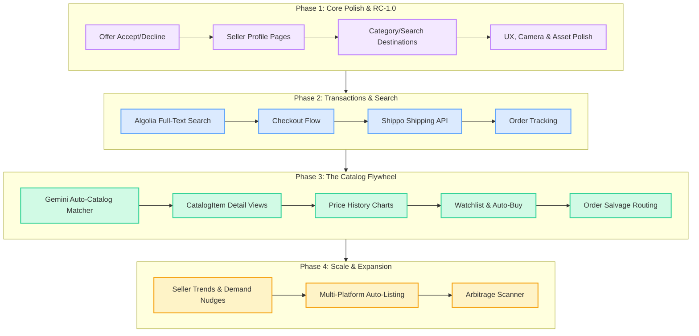

# Wonni

**AI-first marketplace iOS app.** Wonni helps sellers list fast (camera → AI identification → live listing in seconds) and helps buyers discover, save, and buy items.

**Author:** Jerry Shi  
**Stack:** SwiftUI · Firebase (Auth, Firestore, Storage, AI) · Gemini 1.5 Flash

---

## Product Vision

> **This section documents strategic decisions that are intentionally deferred to post-1.0 but must not be designed around or away from.**

### The Item Catalog (post-1.0)

The long-term data model for Wonni is **organized by item, not by listing** — closer to Amazon than eBay. A `CatalogItem` is a shared, platform-managed product record (think: "2024 Starbucks Popcorn Bucket, Red Edition"). Multiple sellers can each have a `UserListing` that references the same `CatalogItem`.

This is deferred from 1.0 due to implementation complexity (catalog seeding, matching heuristics, moderation) — but the FK scaffolding is already in place so no migration is needed.

**Why this is the core strategic bet — four compounding benefits:**

**1. Out-of-stock conversion (buyer side)**  
On eBay, a sold-out listing is a dead end — the buyer sees "similar items" that may be irrelevant. On Wonni, a sold-out `CatalogItem` page can surface:
- A "Notify me when back in stock" watchlist button that actually works (we know exactly which item they want)
- An auto-purchase option (first seller who relists at ≤ $X automatically fulfills it)
- A real-time count of other sellers currently listing this item

**2. Cancelled order salvage (seller + buyer side)**  
When Seller A cancels a transaction, Wonni can silently route the order to Seller B who has the same `CatalogItem` in stock — Seller B makes a sale they never would have seen, and the buyer's experience is seamless. This is only possible when you know that two separate `UserListings` represent the same physical item.

**3. Better pricing data (seller side)**  
Pricing on eBay requires searching "sold listings" manually. A `CatalogItem` accumulates real transaction history across all sellers — median sale price, 30-day trend, seasonal patterns. Wonni can pre-fill a suggested price at listing time with actual confidence. This lowers seller friction and anchors prices to reality.

**4. Demand aggregation for seller acquisition**  
This is the flywheel nobody sees: when 50 buyers are watching a sold-out `CatalogItem`, that demand signal is invisible to potential sellers today. With the catalog, Wonni can message sellers: *"47 people are actively watching this item and there are 0 in stock — list yours now."* This turns latent buyer demand into direct seller acquisition, without any paid marketing.

**Existing scaffold (already built):**
- `CatalogItem.swift` — model file exists in `Models/`
- `UserListing.catalogItemId: String` — FK field present on every listing
- `SavedItem.catalogItemId: String?` — nil now, ready for catalog migration
- `InventoryUnit.swift` — per-unit tracking model exists
- Firestore `favorites` subcollection already stores `catalogItemId` for future watchlist use

**What 1.0 avoids:** Wonni 1.0 ships with `catalogItemId = ""` on all listings (no catalog matching). The UI and data layer treat listings independently. The catalog is introduced post-1.0 via a background matching pass (Gemini identifies item → matches to existing `CatalogItem` or creates a new one) without requiring a client update.

---

## Building and Running

```bash
open wonni/wonni.xcodeproj
```

Requirements: iOS 17+, Xcode 15+, camera + photo library permissions.

```bash
# CLI build
cd wonni
xcodebuild -project wonni.xcodeproj -scheme wonni \
  -destination 'platform=iOS Simulator,name=iPhone 15' build
```

---

## Architecture

### Backend

All data lives in Firebase:

| Service | Purpose |
|---|---|
| **Firestore** | Listings, users, conversations, messages, favorites, search history |
| **Firebase Storage** | Listing photos at `users/{userId}/{listingId}/{index}.jpg` |
| **Firebase Auth** | Sign In with Apple + email/password |
| **Firebase AI (Gemini)** | Item identification from photos — model `gemini-1.5-flash` via `.googleAI()` backend |

### Data Layer (`wonni/Data/`)

| File | Responsibility |
|---|---|
| `ListingRepository.swift` | CRUD for listings, paginated feed (`fetchFeedPage`), prefix-match search support |
| `StorageService.swift` | Photo upload to permanent Storage paths, deletion |
| `GeminiService.swift` | Item identification from `[UIImage]` → `GeminiIdentificationResponse` |
| `ConversationRepository.swift` | Conversations + messages, offer flow, real-time listeners |
| `SearchRepository.swift` | Trending, search history, saved searches, prefix-match listing search |
| `UploadManager.swift` | Orchestrates draft → upload → Gemini → publish flow |
| `AuthManager.swift` | Firebase Auth state, sign-in/sign-out |
| `ImageCompressor.swift` | Resize images before Storage upload |

### Models (`wonni/Models/`)

| File | Key Types |
|---|---|
| `UserListing.swift` | `UserListing`, `ListingStatus`, `ItemCondition` |
| `CatalogItem.swift` | Shared product catalog (future — referenced by `catalogItemId`) |
| `InventoryUnit.swift` | Per-unit inventory tracking |

### View Structure (`wonni/Views/`)

5-tab navigation (`MainView.swift`):

| Tab | View | Status |
|---|---|---|
| Home | `HomeView` | Live feed + promoted carousel + infinite scroll |
| Search | `SearchView` | Saved / recent / trending + prefix-match results |
| Sell | `CameraView` → `CreateListingView` | Full listing flow |
| Inbox | `InboxView` → `ConversationView` | Messages + offer flow |
| Profile | `ProfileView` | Listings grid + sign out |

Supporting views: `ListingDetailView` (photos, offer button, favorites, suggested listings), `IdentificationConfirmationView` (Gemini result review).

### Key Patterns

**Listing photos:** Pre-generate a UUID client-side as `listingId`, upload to `users/{uid}/{listingId}/{index}.jpg`, then write the Firestore document with that same ID. No temp→promote dance.

**Feed pagination:** Firestore cursor-based (`startAfter(document:)`). `ListingRepository.fetchFeedPage(after:)` returns a `FeedPage` with `lastDocument: DocumentSnapshot?` for the next page. Requires composite index: `status ASC + publishedAt DESC`.

**Promoted banners:** `PromotedBanner` documents in a `promotions` Firestore collection. `destinationType` + `destinationValue` fields drive routing via `BannerDestination` enum — adding a new destination is one enum case + one `navigationDestination` branch. `expiresAt: Timestamp?` for scheduled promotions.

**Conversation IDs:** Deterministic — `"\(buyerId)_\(listingId)"` — one thread per buyer+listing pair, no duplicate-check query needed.

**Search:** Firestore prefix-match on `customTitle` for 1.0. `SearchRepository.search(query:)` is the single method to swap for Algolia (see backlog).

**Favorites:** `users/{uid}/saved/{listingId}` with `catalogItemId: String?` nil now, ready for catalog migration.

---

## Firebase Setup

### Firestore Rules
Deploy with:
```bash
cd wonni && firebase deploy --only firestore:rules
```

### Firestore Indexes
Deploy composite indexes (feed + promotions queries):
```bash
cd wonni && firebase deploy --only firestore:indexes
```

### Storage Rules
```bash
cd wonni && firebase deploy --only storage
```

### Trending Searches
Seed manually in Firebase Console → `trending` collection:
```
query: "Sony headphones"   sortOrder: 0   isActive: true
```

### Promoted Banners
Seed in Firebase Console → `promotions` collection:
```
title: "Weekend Sale"   subtitle: "Up to 40% off"
destinationType: "category"   destinationValue: "Electronics"
isActive: true   sortOrder: 0   colorHex: "3B82F6"
expiresAt: <Timestamp>   (optional, omit for permanent)
```

---

## Feature Status

### ✅ Completed

**Auth & Onboarding**
- Sign In with Apple + email/password via Firebase Auth
- Onboarding flow, sign-out from profile

**Sell Flow**
- Camera view with live viewfinder, photo capture, gallery upload
- Photo stacking (`[[UIImage]]`) with scrollable stack carousel
- Plus button to create new stacks; portrait lock with orientation correction
- Flash animation on capture (known bug: doesn't cover tab bar — see bugs)
- `CreateListingView`: draft carousel, upload progress, Gemini identification confirmation
- Inline price + description editing on result card after upload
- Draft persistence and session restore

**Feed (Home Tab)**
- Live Firestore feed of active listings, 2-column grid with fixed square thumbnails (no overflow)
- Cursor-based infinite scroll (20 per page, `startAfter` cursor)
- Promoted banner carousel: auto-scrolls every 4s, `BannerDestination` routing, `expiresAt` scheduling

**Search Tab**
- Liquid glass search bar: capsule shape + `.ultraThinMaterial` frosted background, camera circle button outside pill, Cancel replaces camera when focused
- Saved searches (Firestore, bookmarked queries, fill bookmark icon when saved)
- Recent searches (Firestore, capped at 10, deduped by query key)
- Trending searches (Firestore `trending` collection, manually curated)
- Section order: Saved → Recent → Trending
- Swipe-to-delete on saved + recent; long-press context menu (Save / Delete)
- Prefix-match search results in 2-column grid

**Listing Detail**
- Photo carousel (TabView paged), price, condition, title, description
- Heart button: tap to save, long-press context menu to add to custom list or create new list
- Make an Offer sheet (hidden for listing owner)
- Offer submitted → conversation created → green toast confirmation
- Suggested listings horizontal scroll

**Inbox & Messaging**
- Mercari-style filter pills: All / Buying / Selling / Unread / Offers
- Real-time conversation listener
- `ConversationView`: message list (auto-scroll to bottom), offer cards, input bar
- Deterministic conversation IDs (one thread per buyer+listing)
- Unread counters, orange Offer badge

**Profile**
- User avatar (initials), display name, email
- 2-column grid of active listings with cover photo
- Tap listing → `ListingDetailView`
- Sign out with confirmation alert

**Backend / Infrastructure**
- Firestore rules: listings, inventory, conversations, messages, users + all subcollections, trending
- Firebase Storage rules: `users/{userId}/**` owner-write + authenticated read
- Composite Firestore indexes: feed query, promotions query
- Gemini AI: `gemini-1.5-flash` model, resizes images to 1024px before sending

---

### 🔄 Product Roadmap (Integrated Backlog)

This roadmap outlines the plan for executing all remaining backlog features, shifting Wonni from an independent listings prototype to a production-ready, AI-driven resale marketplace centered around the **Item Catalog** model.



---

#### 🟣 Phase 1: Core Polish & Release Candidate 1.0
*Focus: Close all existing feature stubs, complete basic authentication flows, clean up UI layouts, and deploy backend configurations.*

- [ ] **Offer Accept / Decline Logic**  
  Implement Firestore transaction logic in `ConversationRepository.swift` to handle `OfferCard` action triggers (decline updates status to `declined`; accept updates status to `accepted`, creates an `Order` document, and moves listing status from `active` to `sold`).
- [ ] **Seller Profile Integration**  
  Resolve truncated `userId` labels in `ListingDetailView` by setting up a `/users` Firestore collection storing display names, custom profile avatars, and review ratings, then wire them up to the Profile views.
- [ ] **Category & Search Routing**  
  Build the `CategoryFeedView` to filter active listings by category, and wire up category/search navigation targets for `BannerDestination` routing from `MainView.swift`.
- [ ] **Deploy Firestore Rules + Indexes**  
  Run `firebase deploy --only firestore:rules,firestore:indexes` to activate feed sorting indexes and query rules.
- [ ] **Camera UX & Polish**  
  - Fix the local camera flash overlay in `CameraView` to cover the global Tab Bar container (either by moving it to `MainView` or boosting its z-index).
  - Add a scale-down animation that shrinks captured photos from the main viewport down to the bottom-left carousel stack.
- [ ] **App Polish & Reusability**  
  - Extract the duplicated listing grid cards from `HomeView.swift` and `SearchView.swift` into a unified, reusable `FeedListingCard.swift`.
  - Design and integrate the app icon assets and launch screens.

---

#### 🔵 Phase 2: Checkout, Logistics & Search Discovery
*Focus: Equip the app with payment processing, shipping label generation, order tracking, and high-performance search.*

- [ ] **Algolia Full-Text Search Integration**  
  Install the Algolia Firebase Extension and replace the prefix-matching logic inside `SearchRepository.search(query:)` with an Algolia search client call to enable typo-tolerance and mid-word matches.
- [ ] **Live Search Suggestions**  
  Implement a typing listener on the capsule search bar that triggers debounced search term completions.
- [ ] **Browse by Category**  
  Introduce category hierarchies and subcategory browsing filters in the Search tab.
- [ ] **Checkout Flow**  
  Develop the buying flow, integrating a payment details sheet (via Stripe/Apple Pay) to complete orders.
- [ ] **Shipping Integration (Shippo API)**  
  Integrate the **Shippo API** to auto-calculate shipping fees using weight and dimensions from the seller's edit sheet, generate carrier labels, and display return QR codes.
- [ ] **Order Tracking**  
  Embed an order tracking visualizer inside user details drawing carrier status updates directly from USPS/UPS API webhooks.
- [ ] **Category Tagging on Listings**  
  Add category classification options to the seller's draft edit flow, feeding into search taxonomy.

---

#### 🟢 Phase 3: The Catalog Flywheel (Strategic Core)
*Focus: Move database architecture from listing-based to catalog-based by implementing the shared CatalogItem.*

- [ ] **Gemini Auto-Catalog Matcher**  
  Construct an asynchronous background matching pass (via Firebase Cloud Functions or client triggers) that uses Gemini to identify listing parameters and link the listing to a `CatalogItemId`.
- [ ] **CatalogItem Product Pages**  
  Build detail views for specific catalog products showing aggregated description details, active listings sorted by condition/price, and a price history chart (using SwiftUI Charts) drawn from historical sales.
- [ ] **Price History Charts**  
  Develop price history trends on the listing detail sheet showing median prices and sales velocities.
- [ ] **Watchlist / "Notify me" Alerts**  
  Let buyers bookmark a sold-out `CatalogItem` and receive immediate APNS push notifications the instant any seller posts a matching item.
- [ ] **Offer Alerts for Saved Searches**  
  Notify buyers when new listings match their saved query parameters (e.g. "iPhone 12 under $200").
- [ ] **"X Sold Recently" Badge**  
  Display real-time sales volume counts on listings to increase buying urgency.
- [ ] **Seller Performance Metrics**  
  Display shipping speeds, defect rates, and user reviews on profile cards.

---

#### 🟡 Phase 4: Sourcing, Advanced Automation & Polish
*Focus: Automate pricing, cross-posting, order recovery, and scale supply acquisition.*

- [ ] **Auto-Purchase Options**  
  Allow buyers to set a maximum bid for a sold-out `CatalogItem` and automatically purchase the first matching listing that comes online at or below that price.
- [ ] **Cancelled Order Salvage**  
  If a seller cancels a transaction, automatically reroute the order to the next available seller holding the same `CatalogItem` at a similar price.
- [ ] **Seller Demand Nudges**  
  Acquire inventory by alerting sellers with relevant notifications: *"47 buyers are watching this item with 0 in stock. List yours now."*
- [ ] **Trending Items Feed for Sellers**  
  Create an analytics feed for sellers showing catalog items with high demand and low inventory.
- [ ] **Multi-Platform Auto-Listing**  
  Integrate eBay, Etsy, and TikTok Shop APIs to allow sellers to cross-list items, showing a true take-home price calculator after accounting for platform fees.
- [ ] **Community Moderation System**  
  Build dispute resolution and item catalog editing tools for community moderators.
- [ ] **Dark Mode & iPad Optimization**  
  Add dark mode styling and responsive iPad grid layouts.
- [ ] **Widgets for Watched Items**  
  Create iOS Home Screen widgets tracking price trends of items on a user's watchlist.

---

### 💡 Long-term Wishlist

- Multi-platform posting: auto-list on eBay/Etsy/TikTok Shop/Amazon with seller's take-home price + fees
- AliExpress API integration for trending item discovery and bulk purchasing
- Email integration: auto-populate drafts from purchase confirmation emails
- Arbitrage scanner: scrape eBay/Etsy/Mercari for margin opportunities
- Location-based seller alerts (concert merch, movie theater exclusives)
- Live selling + short video selling with affiliate commission model
- Doordash-style door pickup / packaging service
- SMS 2FA + urgent alerts via Twilio
- Cancelled order salvage: route to alternate in-stock sellers
- Local pickup / local sales
- "#1 in Concert Tees" category rank badges (Amazon-style)
- Damaged shipment insurance claim processing
- Community-balanced marketplace policies (7-day buyer return window, auto-5-star if no review within shipping SLA, etc.)

---

## Known Bugs

| Bug | Details | Fix Direction |
|---|---|---|
| Flash doesn't cover tab bar | `isFlashing` state is local to `CameraView` | Move flash overlay to `MainView` root or increase z-index |
| SourceKit stale index errors | "No such module 'FirebaseAI'" etc. appear after edits | Not real build errors; clear on Xcode clean build |

---

## Sources & Attributions

- [Apple Capturing Photos sample app](https://developer.apple.com/tutorials/sample-apps/capturingphotos-camerapreview) — camera system architecture
- [Hacking with Swift Complete SwiftUI Tutorial](https://www.hackingwithswift.com/quick-start/swiftui/swiftui-tutorial-building-a-complete-project)
- [Hacking with Swift @FocusState](https://www.hackingwithswift.com/quick-start/swiftui/what-is-the-focusstate-property-wrapper)
- [Hacking with Swift ScrollView](https://www.hackingwithswift.com/quick-start/swiftui/how-to-add-horizontal-and-vertical-scrolling-using-scrollview)
- [Swiftful Thinking — Paging ScrollView iOS 17](https://www.youtube.com/watch?v=hCpM95KHb_Q)
- [Medium — LazyVGrid Collection View](https://bhoopendraumrao.medium.com/a-step-by-step-guide-to-implementing-collection-view-style-in-swiftui-db4c6989a4d)
